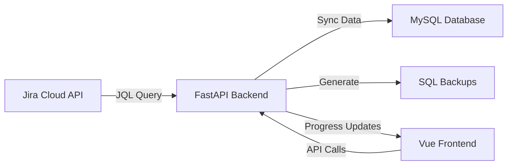

# Documentación Técnica - Jira Sync Application

## Índice
1. [Arquitectura General](#arquitectura-general)
2. [Backend (FastAPI)](#backend-fastapi)
3. [Frontend (Vue 3)](#frontend-vue-3)
4. [Base de Datos](#base-de-datos)
5. [API Endpoints](#api-endpoints)
6. [Sistema de Backups](#sistema-de-backups)
7. [Docker](#docker)
8. [Integración MCP](#integración-mcp)

---

## Arquitectura General

### Descripción
Sistema full-stack para sincronizar issues de Jira Cloud con MySQL, con generación automática de backups SQL.

### Stack Tecnológico
- **Backend**: FastAPI (Python 3.10+)
- **Frontend**: Vue 3 + TypeScript + Pinia + Tailwind CSS
- **Base de Datos**: MySQL 5.7+
- **Contenedores**: Docker + Docker Compose
- **Proxy**: Nginx

### Flujo de Datos


---

## Backend (FastAPI)

### Estructura de Archivos
```
my-fastapi-app/
├── main.py              # Aplicación principal
├── requirements.txt     # Dependencias Python
├── Dockerfile          # Imagen Docker
└── backups/           # Directorio de backups SQL
```

### Modelos de Datos

#### JiraSyncRequest
```python
class JiraSyncRequest(BaseModel):
    # Configuración Jira
    jira_domain: str
    jira_email: str
    jira_api_token: str
    jql: str
    fields: Union[List[str], Dict[str, str]]
    
    # Configuración MySQL
    mysql_host: str
    mysql_port: int = 3306
    mysql_user: str
    mysql_password: str
    mysql_database: str
    mysql_table: str
    
    # Paginación
    max_results_per_page: int = 50
```

### Sistema de Tareas Asíncronas

#### Estados de Sincronización
1. `iniciando` - Inicialización
2. `obteniendo_total` - Conteo de issues
3. `conectando_db` - Conexión MySQL
4. `descargando` - Descarga de Jira (0-50%)
5. `preparando_tabla` - Creación/actualización de tabla
6. `sincronizando` - Inserción en MySQL (50-95%)
7. `generando_respaldo` - Generación de backup SQL (95-100%)
8. `completado` - Proceso exitoso
9. `error` - Error en el proceso

#### Almacenamiento en Memoria
```python
background_tasks_store = {}  # task_id -> task_info
```

### Funciones Principales

#### sync_jira_issues_background
- Ejecuta la sincronización en un thread separado
- Actualiza el progreso en tiempo real
- Maneja errores y los registra

#### generate_backup
- Genera backup SQL usando Python nativo
- Incluye metadata (fecha, hora, task_id)
- Verifica la creación del archivo
- Retorna información detallada del backup

#### ensure_table_exists
- Crea tabla si no existe
- Detecta tipos de datos automáticamente
- Agrega columnas dinámicamente
- Soporta mapeo personalizado de campos

---

## Frontend (Vue 3)

### Estructura de Componentes
```
front/src/
├── components/
│   ├── JiraSyncForm.vue        # Formulario de configuración
│   ├── SyncProgressConsole.vue # Consola de progreso
│   ├── SyncDetailModal.vue     # Modal de detalles
│   └── SyncHistoryList.vue     # Lista de histórico
├── stores/
│   └── jiraSync.ts            # Store Pinia
├── views/
│   ├── Home.vue
│   ├── JiraSyncView.vue
│   └── About.vue
└── router/
    └── index.ts
```

### Store (Pinia)

#### Estado
```typescript
interface SyncTask {
  task_id: string
  status: string
  progress_percentage: number
  total_issues: number
  processed_issues: number
  message: string
  started_at: string
  completed_at: string | null
  error: string | null
  result: any | null
  backup_file?: string
  backup_path?: string
  backup_absolute_path?: string
  backup_size?: number
}
```

#### Acciones Principales
- `startSync(config)` - Inicia sincronización
- `checkStatus(taskId)` - Verifica estado
- `testMySQLConnection(config)` - Prueba conexión
- `getAllSyncLogs()` - Obtiene logs de BD
- `deleteTask(taskId)` - Elimina tarea y backup

### Características UI/UX
- Diseño responsive (mobile-first)
- Consola estilo terminal
- Polling automático cada 2 segundos
- LocalStorage para persistencia
- Import/Export de configuraciones

---

## Base de Datos

### Tabla: sync_logs
```sql
CREATE TABLE sync_logs (
    id INT AUTO_INCREMENT PRIMARY KEY,
    task_id VARCHAR(255) UNIQUE NOT NULL,
    started_at TIMESTAMP NOT NULL,
    completed_at TIMESTAMP NULL,
    status VARCHAR(50) NOT NULL,
    jql_query TEXT NOT NULL,
    config JSON NULL,
    total_issues INT DEFAULT 0,
    processed_issues INT DEFAULT 0,
    error_message TEXT NULL,
    result JSON NULL,
    backup_file VARCHAR(255) NULL,
    created_at TIMESTAMP DEFAULT CURRENT_TIMESTAMP,
    updated_at TIMESTAMP DEFAULT CURRENT_TIMESTAMP ON UPDATE CURRENT_TIMESTAMP,
    INDEX idx_task_id (task_id),
    INDEX idx_status (status),
    INDEX idx_started_at (started_at)
)
```

### Tabla Dinámica de Issues
- Nombre configurable por usuario
- Columnas creadas dinámicamente
- Tipos detectados automáticamente:
  - BOOLEAN
  - BIGINT
  - DOUBLE
  - JSON
  - TEXT

---

## API Endpoints

### Sincronización
```
POST /sync-jira-issues
Body: JiraSyncRequest
Response: { task_id: string }
```

### Estado y Monitoreo
```
GET /sync-status/{task_id}
GET /sync-tasks?limit=10
GET /sync-logs?limit=10&offset=0
GET /sync-logs/{task_id}
GET /sync-logs/load-from-db/{task_id}
```

### Gestión de Backups
```
GET /backups
GET /backups/{filename}
GET /backups/{filename}/info
DELETE /backups/{filename}
```

### Testing y Validación
```
POST /test-mysql-connection
POST /test-jira-connection
```

### Gestión de Tareas
```
DELETE /sync-tasks/{task_id}
```

---

## Sistema de Backups

### Generación
1. Se ejecuta al 95% del progreso
2. Usa Python nativo (no requiere mysqldump)
3. Formato: `jira_sync_YYYY-MM-DD_HH-MM-SS.sql`
4. Incluye metadata completa en comentarios SQL

### Contenido del Backup
```sql
-- Jira Sync Backup
-- Generated: 2024-01-15 14:30:45 (Mexico/Ciudad de México)
-- Task ID: abc123-def456
-- Table: jira_issues
-- Total Issues: 500
-- Database: jiradb
-- Host: localhost
-- Backup Path: C:\path\to\backup.sql
-- Container Path: /app/backups/backup.sql

USE `jiradb`;

DROP TABLE IF EXISTS `jira_issues`;
CREATE TABLE `jira_issues` (...);

INSERT INTO `jira_issues` VALUES ...;
```

### Almacenamiento
- Local: `./backups/`
- Docker: Volumen mapeado a `/app/backups/`
- Acceso directo vía API

---

## Docker

### docker-compose.yml
```yaml
services:
  backend:
    build: ./my-fastapi-app
    volumes:
      - ./backups:/app/backups
    ports:
      - "8000:8000"
      
  frontend:
    build: ./front
    ports:
      - "80:80"
    depends_on:
      - backend
```

### Volúmenes
- `./backups:/app/backups` - Persistencia de backups SQL

### Health Checks
- Backend: `GET /health`
- Frontend: wget al index

---

## Integración MCP

### Capacidades
El sistema está diseñado para ser accesible vía MCP:

1. **Endpoints RESTful** - Todos los endpoints siguen estándares REST
2. **Respuestas JSON** - Formato consistente
3. **Autenticación** - Preparado para JWT/OAuth2
4. **Rate Limiting** - Puede agregarse fácilmente

### Ejemplo de Integración
```javascript
// MCP Tool Definition
{
  name: "jira-sync",
  description: "Sync Jira issues to MySQL",
  parameters: {
    jira_domain: { type: "string" },
    jql: { type: "string" },
    mysql_config: { type: "object" }
  },
  endpoint: "http://api.example.com/sync-jira-issues"
}
```

### Casos de Uso MCP
1. Sincronización programada
2. Integración con flujos de trabajo
3. Generación automática de reportes
4. Backup automático de proyectos

---

## Mejores Prácticas

### Seguridad
- Tokens de API no se almacenan en logs
- Conexiones MySQL con SSL (configurable)
- Sanitización de inputs SQL
- CORS configurado restrictivamente

### Performance
- Paginación en Jira API (50 issues/página)
- Batch inserts en MySQL (100 rows/batch)
- Índices en campos clave
- Conexiones reutilizables

### Monitoreo
- Logs estructurados con niveles
- Métricas de progreso en tiempo real
- Histórico completo en base de datos
- Health checks para Docker

### Mantenimiento
- Backups automáticos
- Limpieza de logs antiguos (configurable)
- Versionado de API
- Documentación actualizada

---

## Próximas Mejoras

1. **Autenticación y Autorización**
   - JWT tokens
   - Roles y permisos
   - Multi-tenancy

2. **Schedulers**
   - Cron jobs integrados
   - Sincronización programada
   - Notificaciones

3. **Métricas y Observabilidad**
   - Prometheus metrics
   - Grafana dashboards
   - Alerting

4. **Escalabilidad**
   - Redis para caché
   - Celery para tareas
   - Kubernetes deployment 